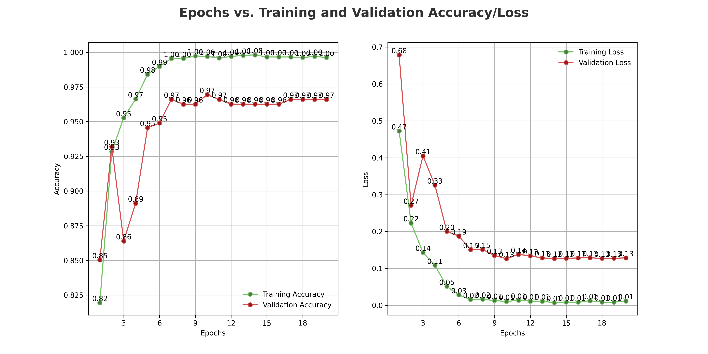
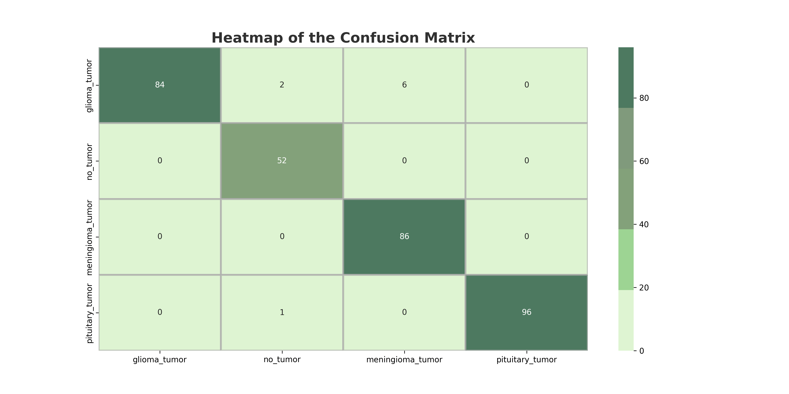
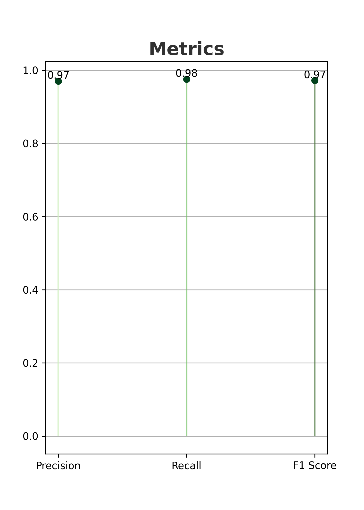

# Brain MRI Tumor Classification

## Description
This is a personal project in which I build a classification solution to detect brain tumors through MRI.
The goal is to predict whether a patient has a brain tumor (glioma tumor, meningioma tumor, pituitary tumor) or not based on their brain MRI images 🩻

I had the idea of this project thanks to my current job in neuroimaging research.
The MRI images come from [here](https://github.com/sartajbhuvaji/brain-tumor-classification-dataset).

To avoid training a heavy a classification model from scratch, I use the EfficientNetB0 model
It's a lightweight and very efficient model on imagenet and image classification transfer learning tasks.
Information about the model can be found [here](https://keras.io/examples/vision/image_classification_efficientnet_fine_tuning/). 

## Table of Contents
- [ML model's performances](#ml-models-performances)

## ML model's performances

I use Keras's checkpoint callback to ensure the model saved is the one with the highest validation accuracy.

