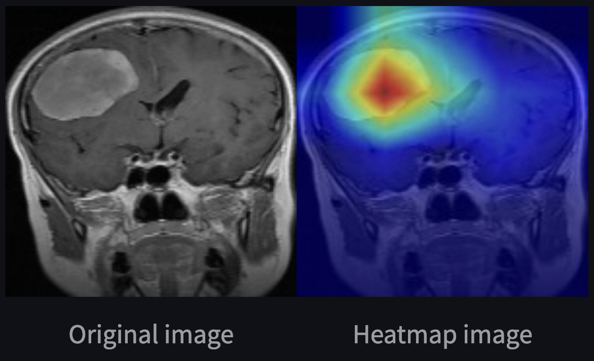

# Brain MRI Tumor Classification

## Table of Contents
- [Preview](#preview)
- [Description](#description)
- [Local installation](#local-installation)
- [Usage](#usage)
- [Model performances](#model-performances)

## Preview

## Description
You can test my website [here](https://tim-brain-mri-diagnostic.streamlit.app/) 😎

This is a personal project in which I build a classification solution to detect brain tumors through T1-weighted, T2-weighted and FLAIR MRI.
I had the idea of this project thanks to my current job in neuroimaging research.
The goal is to predict whether a patient has a brain tumor (glioma tumor, meningioma tumor, pituitary tumor) or not based on their brain MRI images 🩻

The 7023 MRI images come from [this](https://www.kaggle.com/datasets/masoudnickparvar/brain-tumor-mri-dataset/data) dataset.
I implemented a preprocessing step on the raw dataset to delete the duplicates and crop the useless borders of the images.

To avoid training a heavy classification model from scratch, I use the EfficientNetV2B0 model.
It's a lightweight and very efficient model on imagenet and image classification transfer learning tasks.
Information about the model can be found [here](https://arxiv.org/abs/2104.00298).

## Local installation
To install and run this project on your local machine, follow these steps :

1. Clone this repository to your local machine using `git clone https://github.com/timdgn/MRI_Brain_Tumor_Detection.git`
2. Navigate to the project directory using `cd MRI_Brain_Tumor_Detection`
3. Install the required Python (3.9) packages in your favorite virtual environment using `pip3 install -r requirements.txt`
4. Navigate to the source directory using `cd src`
5. Launch the backend with `uvicorn fastapi_app:app --host 127.0.0.1 --port 8000 --reload`
6. Launch the frontend with `streamlit run streamlit_app.py`
7. The web-app should launch by itself, if not go to `http://localhost:8501`
8. Enjoy ✨

## Usage
Follow the 3 numbered steps on the deployed web app to test your tumor diagnostic skills and my AI model's 🤖  
Enjoy the Grad-CAM (Gradient-weighted Class Activation Mapping) technique that helps in visualizing the regions of the brain that contributed the most to the model’s decision 🧠  

## Model performances
I achieved an **Accuracy of 0.997**, a **Sensitivity of 0.997** and a **Specificity of 0.999** when evaluating on the test dataset.   
I use Keras's checkpoint callback to ensure the model saved is the one with the highest validation macro F1 score.

