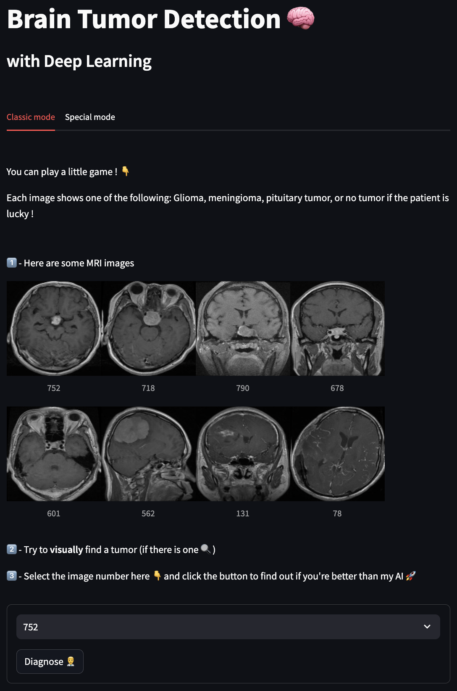
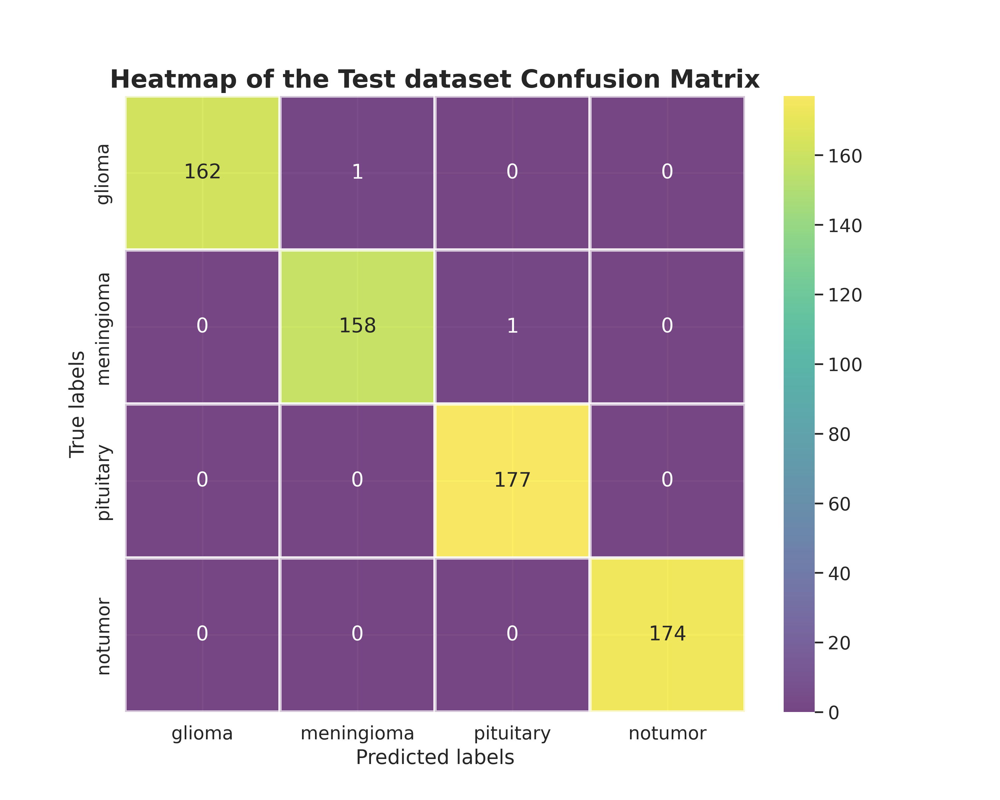
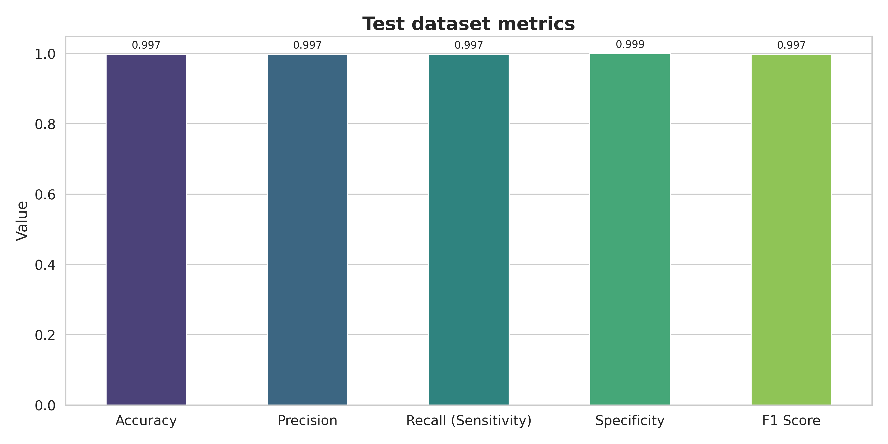

# Brain MRI Tumor Classification

## Preview

## Description
This is a personal project in which I build a classification solution to detect brain tumors through MRI.
The goal is to predict whether a patient has a brain tumor (glioma tumor, meningioma tumor, pituitary tumor) or not based on their brain MRI images 🩻

I had the idea of this project thanks to my current job in neuroimaging research.
The MRI images come from [here](https://github.com/sartajbhuvaji/brain-tumor-classification-dataset).

To avoid training a heavy a classification model from scratch, I use the EfficientNetB0 model.
It's a lightweight and very efficient model on imagenet and image classification transfer learning tasks.
Information about the model can be found [here](https://keras.io/examples/vision/image_classification_efficientnet_fine_tuning/). 

## Table of Contents
- [Local installation](#local-installation)
- [Usage](#usage)
- [ML model's performances](#ml-models-performances)

## Local installation
To install and run this project on your local machine, follow these steps :

1. Clone this repository to your local machine using `git clone https://github.com/timdgn/MRI_Brain_Tumor_Detection.git`
2. Navigate to the project directory using `cd MRI_Brain_Tumor_Detection`
3. Install the required Python (3.9) packages in your favorite virtual environment using `pip3 install -r requirements.txt`
4. Navigate to the source directory using `cd src`
5. Launch the backend with `uvicorn fastapi_app:app --host 127.0.0.1 --port 8000`
6. Launch the frontend with `streamlit run streamlit_app.py`
7. The web-app should launch by itself, if not go to `http://localhost:8501`
8. Enjoy ✨

## Usage
Follow the 3 numbered steps to test your tumor diagnostic skills and my AI model's 😉

## ML model's performances
I use Keras's checkpoint callback to ensure the model saved is the one with the highest validation accuracy.

